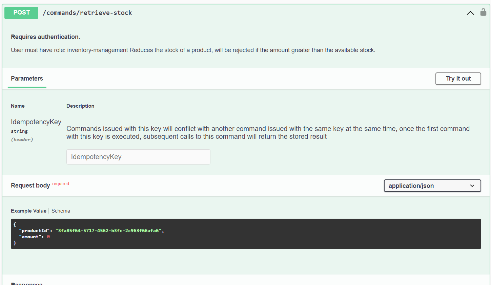

# Command
A command represents an intent to perform an action in the system, it is always related to one entity, and is defined by the `shape`, which must implement `EventModelCommand<EntityShape>` and its definition.

```cs
public record RetrieveStock(Guid ProductId, int Amount) : EventModelCommand<Stock>
{
  public Option<StrongId> TryGetEntityId(Option<UserSecurity> user) => new StrongGuid(ProductId);

  public Result<EventInsertion, ApiError> Decide(
    Option<Stock> entity,
    Option<UserSecurity> user,
    FileUpload[] files
  ) =>
    Amount <= entity.Map(e => e.Amount).DefaultValue(0)
      ? new ExistingStream(new StockRetrieved(ProductId, Amount))
      : new ConflictError("There was not enough stock");

  public IEnumerable<string> Validate()
  {
    if (Amount < 1)
    {
      yield return "Amount can't be smaller than one.";
    }
  }
}

new CommandDefinition<RetrieveStock, Stock>
{
  Description = "Reduces the stock of a product, will be rejected if the amount greater than the available stock.",
  Auth = new PermissionRequired("inventory-management"),
  UsesValidationRules = false
}
```

## Shape interface
### TryGetEntityId
This method returns the id of the entity related to the command if it's possible to know it from the command. Often, commands create a new entity, so this method returns `None` if it's not possible to know the id. In such cases, one often generate a random ID from a Guid, or the entity might be calculated from some information from the user.

### Decide
The `Decide` method receives the entity in its current state, or `None` if it is not available, same as the `user` parameter, which will have a value for an authenticated request, or `None` if the user is not authenticated.

The method needs to return one of the following values:
- An `EventInsertion` object, containing one or more events to be persisted in the **same** stream, there are three kinds of insertions:
  - `ExistingStream`, which guarantees failure if the entity does not exist, and will be rejected if another process inserted an event between the moment the entity fast fetched to process this command and the moment the event is persisted.
  - `CreateStream`, which will be rejected if the entity already exists.
  - `AnyState`, which will perform no checks at all, bear in mind that it is possible that another process might insert an event between the moment we fetch the entity and the moment the event is persisted, meaning that our knowledge about the entity will be outdated.
  - In the cases of `ExistingStream` and `CreateStream`, the framework will re-fetch the entity and execute the `Decide` function again, guaranteeing that any decision made, is done with upto date information.
- An `ApiError` object, which has a mosly self-explanatory inheritance hierarchy: `ValidationError`, `NotFoundError`, `DisasterError`, `ConflictError`, `UnauthorizedError`, and `ForbiddenError`.

#### Matcher functions
There are a series of functions to reduce boilerplate when implementing the `Decide` method. They make it simpler to handle the `Option` types of both the entity and the user.

##### Require
```cs
// A command that needs the entity to exist:
public record RetrieveStock(Guid ProductId, int Amount) : EventModelCommand<Stock>
{
  public Result<EventInsertion, ApiError> Decide(Option<Stock> entity, Option<UserSecurity> user) =>
    this.Require(entity, e =>
      Amount <= e.Amount
        ? new ExistingStream(new StockRetrieved(ProductId, Amount))
        : new ConflictError("There was not enough stock")
    );
}

// A command that needs the entity to exist and the user to be authenticated:
public record RegisterWeighting(int Grams, DateOnly Date, string JourneyId) : EventModelCommand<UserHealthJourney>
{
  public Result<EventInsertion, ApiError> Decide(Option<UserHealthJourney> entity, Option<UserSecurity> user) =>
    this.Require(entity, user, (e, u) =>
      e.UserSub == u.Sub
        ? new ExistingStream(new WeightingRegistered(JourneyId, u.Sub, Grams, Date))
        : new ForbiddenError()
    );

  public Option<string> TryGetEntityId() => JourneyId;
}
```

##### ShouldCreate
```cs
// A command that needs the entity to not exist:
public record CreateProduct(Guid ProductId, string Name) : EventModelCommand<Product>
{
  public Option<string> TryGetEntityId() => ProductId.ToString();
  public Result<EventInsertion, ApiError> Decide(Option<Product> entity, Option<UserSecurity> user) =>
    this.ShouldCreate(entity, () => new EventModelEvent[] { new ProductCreated(ProductId, Name) });
}

// A command that needs the entity to not exist and the user to be authenticated:
public record StartNewJourney(HealthGoal Goal /* omitted */):  EventModelCommand<UserHealthJourney>
{
  public Result<EventInsertion, ApiError> Decide(Option<UserHealthJourney> entity, Option<UserSecurity> user) =>
    this.ShouldCreate(entity, user, u => new EventModelEvent[]
    {
      new UserHealthJourneyStarted(Guid.NewGuid().ToString(), u.Sub, DateOnly.FromDateTime(DateTime.UtcNow), Goal)
    });

  public Option<string> TryGetEntityId() => None;
}
```

### Validate
This method returns a list of validation errors if the command is not valid, its implementation is not mandatory, and the `IEnumerable`-`yield` way of implementing it makes it easy to read, as the list of conditional read like a shopping cart. The framework will return a `ValidationError` if the command is not valid.

The implementation of this method is optional.

> It is important to note that the framework is aware of nullable references in the type, and enforces it, so any field not set as nullable in a project with nullable references enabled, will be rejected if not set when issuing the command.

## Command definition
### Description
This property is used to describe the command, it's usually a one-line description and it's visible in the swagger documentation generated by the framework.
### Auth
This property is used to define the authentication requirements for the command, it can be one of the following types:

- `Everyone` means that any user can execute the command even if they are not authenticated.
- `EveryoneAuthenticated` means that any authenticated user can execute the command, regardless of permissions.
- `PermissionRequired` means that the user must have the specified permission to execute the command.
- `AllPermissionsRequired` means that the user must have **all** the specified permissions to execute the command.
- `OnePermissionRequired` means that the user must have **at least one** of the specified permissions to execute the command.

> This property is optional, if it is not set, the framework will use the `Everyone` authentication.
### UsesValidationRules
This property is used to define if the command uses custom [jsonlogic validation rules](./validation-rules.md), it defaults to false, and it's recommended to keep it like that unless there are plans to enable it, as it has a performance cost.

## Issuing the command:
The framework will generate a POST endpoint and swagger documentation for it, the route will be based on the name of the class tha determines the shape of the command:


### Idempotency key
When issuing a command, it is possible to send a unique idempotency key, this will allow the framework to detect if the command has already been processed, and avoid processing it again. The idempotency key can be a string, a guid, or any other value that can be used to identify the command in a unique manner, for example, a hash of the command or simply a Guid generated by the front end when rendering a form, this way, franctically pushing the save button will not execute the command twice.

If the same key is used at exactly the same time, one of the commands will fail, if it is used at different times, the other commands will return a cached response from the original request. This behaviour is open to change, as the possibility of having the subsequent commands wait for the first one, instead, has been proposed. For now, concurrent attempts will have all but one of the attempts fail with a conflict result.
