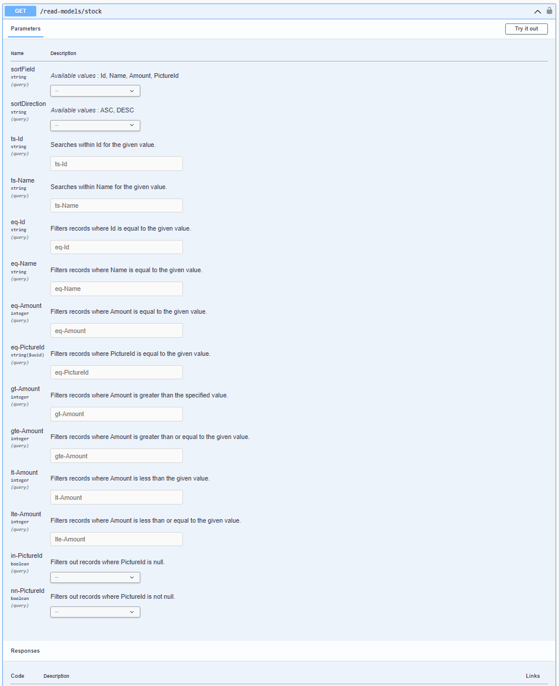
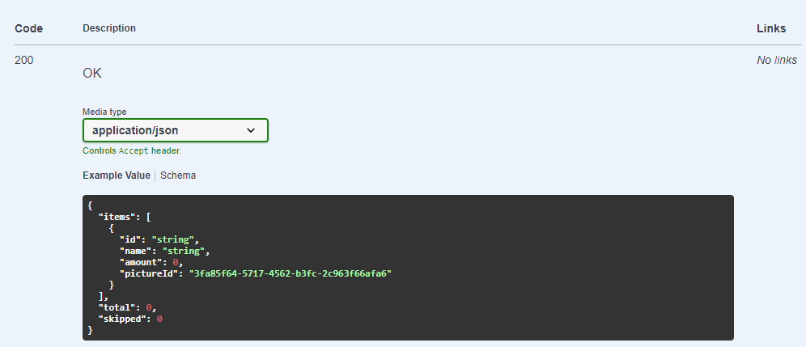
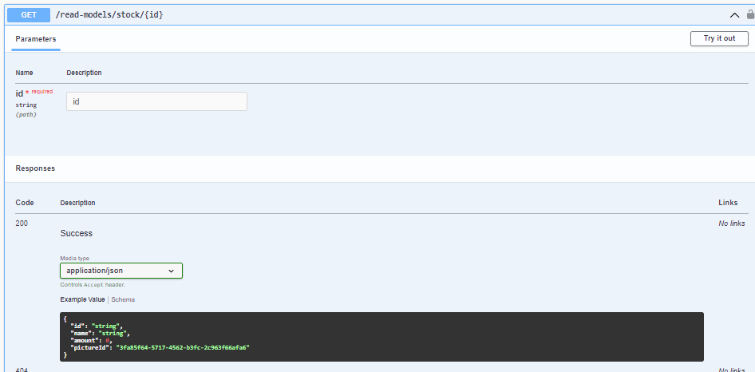

# Read Models
Read models expose data to the outside world. In the Consistent API framework, they are exposed as GET endpoints, one for fetching pages of results and another one to request a single instance.

The read model is defined by its shape and definition:
```cs
public record StockReadModel(
  string Id,
  string Name,
  int Amount,
  Guid? PictureId
) : EventModelReadModel;

new ReadModelDefinition<StockReadModel, Stock>
{
  Projector = stock =>
    new ProductStock(
      stock.ProductId.ToString(),
      stock.ProductName,
      stock.Amount,
      stock.PictureId
    ),
  StreamPrefix = Stock.StreamPrefix,
  Auth = new Everyone()
}
```
## EventModelReadModel
It's an inteface that requires providing a string Id field.

## User bound read models
There is an interface called `UserBound`:
```cs
public interface UserBound
{
  string UserSub { get; }
}
```
If the shape of the read model implements this interface, then it can be used as a user bound read model, and only records with a `UserSub` field matchin the `Sub` of the authenticated user will be returned.

## Definition
### Projector
A function with the signature:
```cs
Option<ReadModelShape> Projector(EntityShape entity);
```
Check on [functional programming concepts](./functional-programming-concepts.md) for a deeper understanding of the `Option` type, but an example of how to use should suffice:
```cs
using static DeFuncto.Prelude; // In order to use `None`, you can also use `Option<Shape>.None`.

Option<ReadModelShape> Projector(EntityShape entity) =>
  entity.IsActive
    ? new ReadModelShape(entity.Id, entity.Name)
    : None;
```
If the method return a value, it will be projected to the read model and exposed through the API both in the list and single endpoints, if it returns None, it will not be inserted, or deleted if it existed.

A read model shape can include objects as properties, but filtering on those properties is not supported beyond null/not null (and only in the case of them being nullable).

> Using nullable references in your project is required for consistent behavior, as they enable the framework to determine which filters to enable for the read model, and to determine the table definition for the storage of the read model.

### StreamPrefix
The stream prefix of the [entity](./entity.md) being projected, it is required in order to subscribe to changes happening to each instance of that entity.

### Auth
This property is used to define the authentication requirements for the command, it can be one of the following types:

- `Everyone` means that any user can execute the command even if they are not authenticated.
- `EveryoneAuthenticated` means that any authenticated user can execute the command, regardless of roles.
- `RoleRequired` means that the user must have the specified role to execute the command.
- `AllRolesRequired` means that the user must have **all** the specified roles to execute the command.
- `OneRoleRequired` means that the user must have **at least one** of the specified roles to execute the command.

> This property is optional, if it is not set, the framework will use the `Everyone` authentication.

### Description
Feature still not implemented, there will be a description field in a future version.

## Eventual Consistency
Read models will always eventually catch up with the stream, will do it as soon as possible, usually, almost immediately, but it must be taken into account that it can take a few milliseconds to catch up in most cases.

## Migrations
If you decide to change the shape of the read model, and you come from a background of using Relational Databases to store the state of the system, you might be dreading this part: How do I migrate something as complex as a read model when it's not a source of truth and there's a framework updating the current version as I run it?

The answer is simple: You do not.

The framework, on startup, will determine the name of the read model table by using the name of the shape and a hash of the data contract (types and nullability), create a completely new table for the new version of the read model, and start hydrating it immediately.

This has two implications:
1. For long living systems, with millions of streams, this can take a while.
1. There is no way to "botch" the migration, as the framework will build the read models from the event log, the source of truth of your system.

For the first issue, you can always create a completely new read model with a different name and let it hydrate while you develop the frontend or any other system that would use it.

> The framework is able to recognize changes in nested types in the objects, but as the time of writing, is unable to detect changes in the nullability of generic parameters, so changing a property from `List<string>` to `List<string?>` will not be detected, and might cause errors.

> The framework does not clean up old read models at the time of writing, it's a feature that will be added in the future.

## The endpoints
### Route
The endpoints will be under `/read-models/`, with the name of the read model shape as the last segment, if the name of the shape ends with `ReadModel`, the framework will remove it.
### List
The framework generates a paginated endpoint with a series of filters, the swagger documentation should be self-explanatory, with the exception of the pagination parameters, `pageNumber` and `pageSize`, which will be included in the next version, but the endpoint will still accept them.

> The `pageNumber` and `pageSize` parameters will be added to the swagger documentation in the next version.



### Single instance
The framework generates a single endpoint, the swagger documentation should be self-explanatory.

