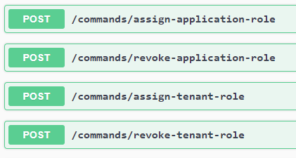
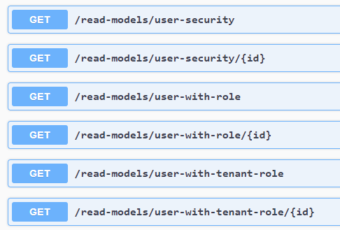

# Security
An OAuth 2.0 authentication service is required to use the Consistent API, it will receive Auth Bearer tokens in the header to authenticate.

## The public keys
On startup, the API needs a collection of public signing keys for your authentication service, that will enable the API to validate the tokens.

## Roles
In the `/swagger/index.html`, there are several self-explanatory [commands](./command.md) and [read models](./read-model.md) that require the `role-management` role.

## The admin subject ID
On startup, the API can receive the admin subject ID, it will assign the `admin` role to the subject ID at startup if it doesn't have it already, this is self healing, if the user were to lose the `admin` role, the API will assign it back on restart.
