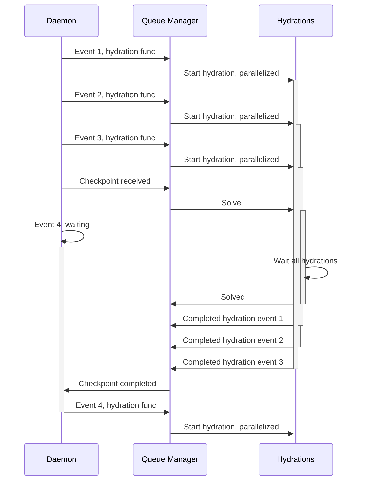
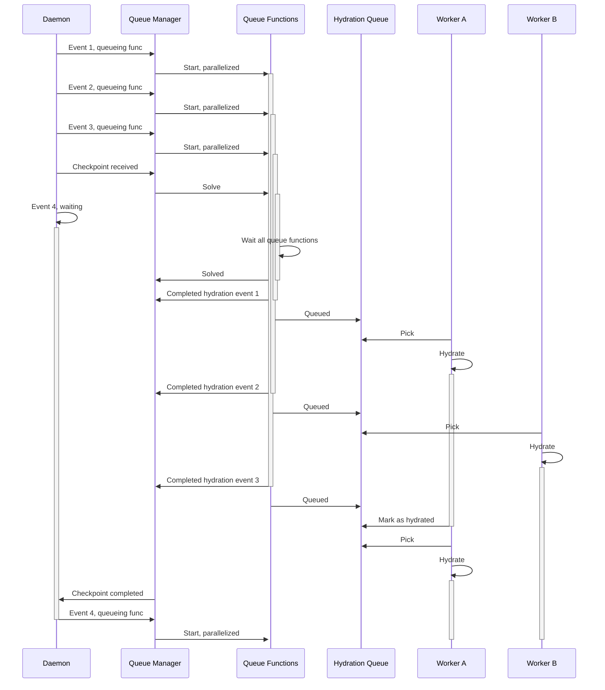

# The hive release
Named after the fact that it uses a swarm of workers to handle read model hydration and todo task execution.

## Hydration workers
### Before
Before the hive release, the hydration operated in a purely reactive per-event hydration, with a queue manager, previously named "state machine". When a new event arrived, the daemon would use the queue manager to start the hydration, releasing the daemon to receive another event to process.

The issue with this approach is, as you can see below, is that while the queue is blocked, be it because a checkpoint has been received, or because the queue is full, the next event that comes will wait, and since the daemon uses a grpc subscription, this can, and will, timeout.

### After
With the introduction of the hydration queue and the workers, the daemon's only responsibility is to receive events and insert create a function that will insert a record in the hydration queue.

## Todo task workers
### Before
### After
## Changes in consistency endpoints
### Before
### After
## Integration tests reliability and speed
### Before
### After