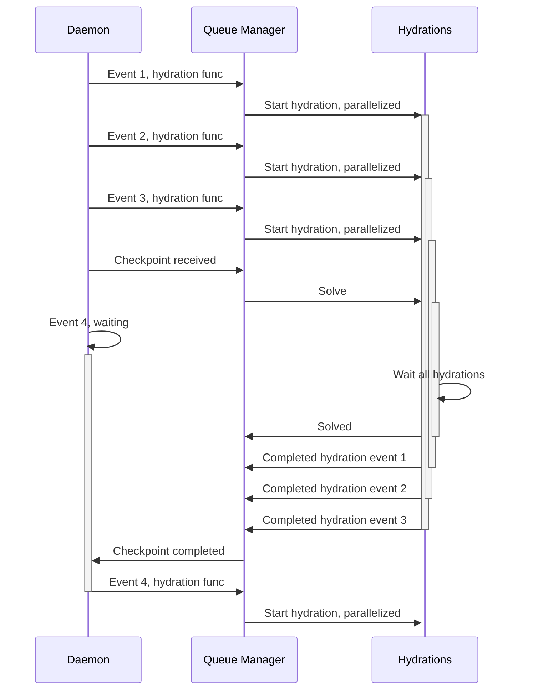
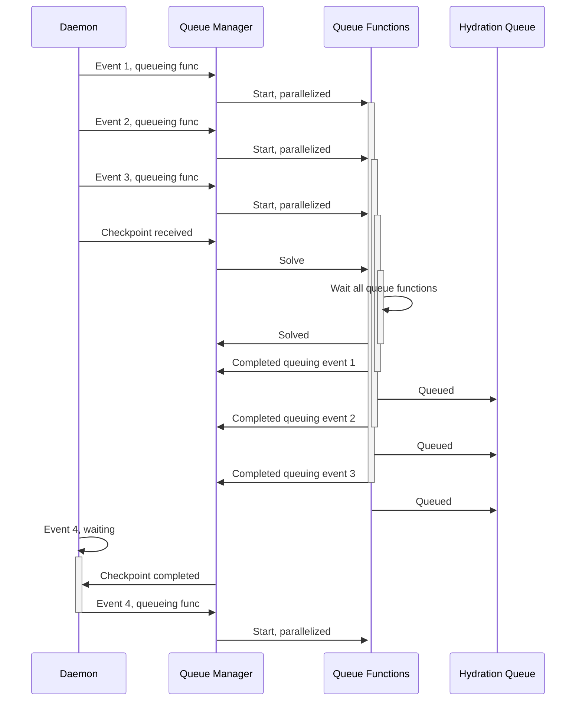
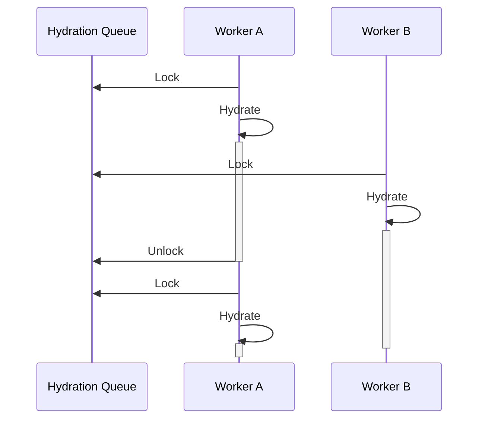

# The hive release
Named after the fact that it uses a swarm of workers to handle read model hydration and todo task execution.

## Hydration workers
### Before
Before the hive release, the hydration operated in a purely reactive per-event hydration, with a queue manager, previously named "state machine". When a new event arrived, the daemon would use the queue manager to start the hydration, releasing the daemon to receive another event to process.

The issue with this approach is, as you can see below, is that while the queue is blocked, be it because a checkpoint has been received, or because the queue is full, the next event that comes will wait, and since the daemon uses a grpc subscription, this can, and will, timeout.

### After
With the introduction of the hydration queue and the workers, the daemon's only responsibility is to receive events and create a function that will insert a record in the hydration queue, which happens at a constant time, removing the risk of timing out from the GRPC connection to the `$all` stream.

Then the workers will compete to pick streams to hydrate, and will run the hydrations without a timeout.

This means that any long running hydration will only lock one worker, and since it won't time out — the worker also refreshes the lock — it will avoid getting stuck in a loop of retrying hydrations, and other workers are free to pick other, faster hydrations.
#### Daemons

#### Workers

## Todo task workers
### Before
The todo task workers already had a queue table, the `TodoEventModelReadModel`, but the processing of it was batched, while the risk of timeout, like the hydrations, was not there, the issues was that a single long-running batch would prevent a new batch to come in. Which was happening with the invoices synchronization.
### After
The new approach simply breaks down the loop that reads the queue to several parallel loops that pick only one task to run, becoming effectively another worker architecture, as the hydrations. Meaning that a long running task can safely keep being executed while new incoming tasks are run.
## Changes in consistency endpoints
Since the workers give granularity in the insights we can get for hydration — given that the hydration queue table has permanent checkpoints, the consistency endpoints now have access to reliable information on hydration state.
## Integration tests reliability and speed
### Before
The integration tests relied on the consistency endpoints to verify consistency before returning a read model.
### After
Instead, a programmatic tool, with in-memory cache is exposed as part of the App interface, this way the integration tests can guarantee consistency when waiting for it, meaning that the safety margins can be reduced dramatically, leading to faster, reliable integration tests.
