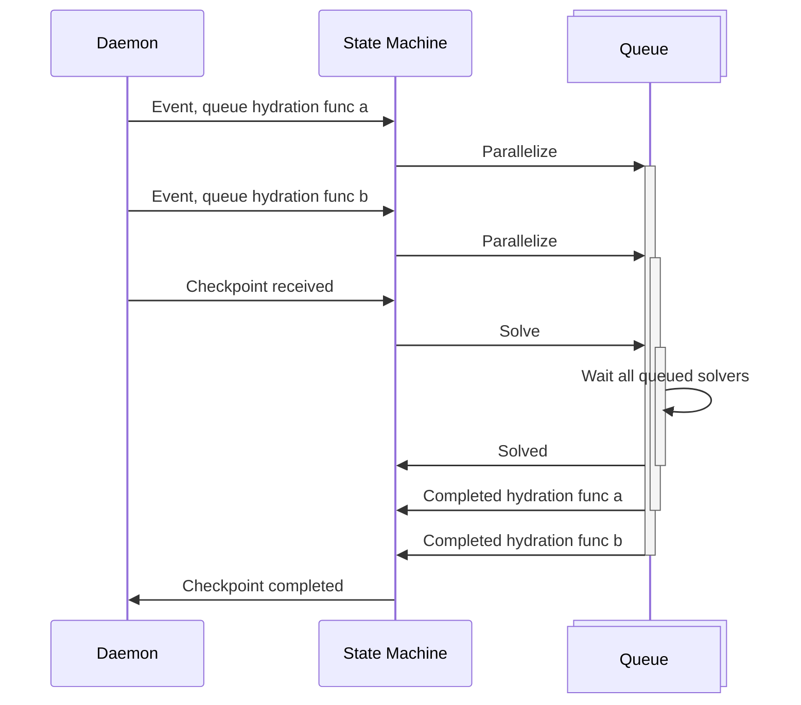

# The hive release
Named after the fact that it uses a swarm of workers to handle read model hydration and todo task execution.

## Hydration workers
### Before

### After
## Todo task workers
### Before
### After
## Changes in consistency endpoints
### Before
### After
## Integration tests reliability and speed
### Before
### After